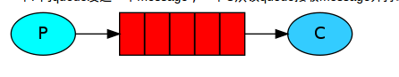
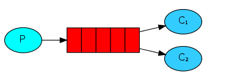

# 消息队列

### 消息队列
[消息队列的应用场景](https://www.zhihu.com/question/34243607)

## RabbitMQ
项目中应用到的消息队列rabbitmq：

&emsp;&emsp;简单例子：生产者和消费者的例子
&emsp;&emsp;收发请求可以啦，然后再来看看其他的问题及其解决方案。
### 问题：
&emsp;&emsp;当消息的发布者在将消息发送出去之后，消息到底有没有正确到达broker代理服务器呢？ 
===》确认机制
#### producer端：
1. 事务机制：RabbitMQ中与事务机制有关的方法有三个：txSelect(), txCommit()以及txRollback(), txSelect用于将当前channel设置成transaction模式，txCommit用于提交事务，txRollback用于回滚事务，在通过txSelect开启事务之后，我们便可以发布消息给broker代理服务器了，如果txCommit提交成功了，则消息一定到达了broker了，如果在txCommit执行之前broker异常崩溃或者由于其他原因抛出异常，这个时候我们便可以捕获异常通过txRollback回滚事务了。
缺点：事务确实能够解决producer与broker之间消息确认的问题，只有消息成功被broker接受，事务提交才能成功，否则我们便可以在捕获异常进行事务回滚操作同时进行消息重发，但是使用事务机制的话会降低RabbitMQ的性能，那么有没有更好的方法既能保障producer知道消息已经正确送到，又能基本上不带来性能上的损失呢？从AMQP协议的层面看是没有更好的方法，但是RabbitMQ提供了一个更好的方案，即将channel信道设置成confirm模式。
2. confirm模式：confirm模式最大的好处在于他是异步的，一旦发布一条消息，生产者应用程序就可以在等信道返回确认的同时继续发送下一条消息，当消息最终得到确认之后，生产者应用便可以通过回调方法来处理该确认消息，如果RabbitMQ因为自身内部错误导致消息丢失，就会发送一条nack消息，生产者应用程序同样可以在回调方法中处理该nack消息。

#### consumer端：
1. basicAck: 手动确认
2. basicRecover：是路由不成功的消息可以使用recovery重新发送到队列中。 
3. basicReject：是接收端告诉服务器这个消息我拒绝接收,不处理,可以设置是否放回到队列中还是丢掉，而且只能一次拒绝一个消息,官网中有明确说明不能批量拒绝消息，为解决批量拒绝消息才有了basicNack。 
4. basicNack：可以一次拒绝N条消息，客户端可以设置basicNack方法的multiple参数为true，服务器会拒绝指定了delivery_tag的所有未确认的消息(tag是一个64位的long值，最大值是9223372036854775807)。
### 问题：
如果RabbitMQ服务器挂了呢？ 
===》队列持久化，消息持久化，Exchanges持久化

### exchanges：
在message到达Exchange后，Exchange会根据route规则进入对应的Queue中，message可能进入一个Queue也可能进入对应多个Queue，至于进入哪个Queue或者是说哪个Queue都不进入，这要依据ExChange的ExchangeType和Exchange所绑定的路由规则，实现AMQP0.9.1协议的RabbitMQ Broker提供了四种ExChangeType。
1. direct
2. fanout
3. topic

### 应用场景
[官网上](http://www.rabbitmq.com/getstarted.html)或者[应用场景](https://www.cnblogs.com/DaBing0806/p/6680766.html)
1. Hello Word  ===》 秒杀活动

控制队列长度，当请求来了，往队列里写入，超过队列的长度，就返回失败
2. work queues 异步处理  ===> goblin接口计费项目

将耗时的消息处理通过队列分配给多个consumer来处理，我们称此处的consumer为
