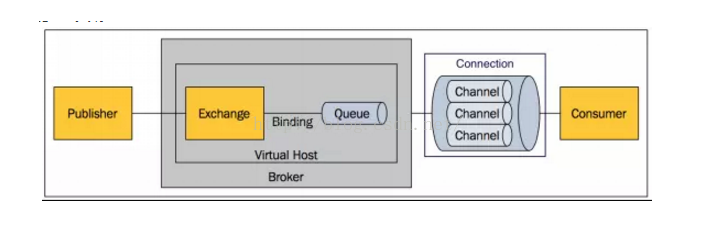

# 消息队列

标签（空格分隔）： mq

---

###消息队列
[消息队列的应用场景](https://www.zhihu.com/question/34243607)

##RabbitMQ
项目中应用到的消息队列rabbitmq：

&emsp;&emsp;简单例子：生产者和消费者的例子
&emsp;&emsp;收发请求可以啦，然后再来看看其他的问题及其解决方案。
###问题：
&emsp;&emsp;当消息的发布者在将消息发送出去之后，消息到底有没有正确到达broker代理服务器呢？ 
===》确认机制
####producer端：
1. 事务机制：RabbitMQ中与事务机制有关的方法有三个：txSelect(), txCommit()以及txRollback(), txSelect用于将当前channel设置成transaction模式，txCommit用于提交事务，txRollback用于回滚事务，在通过txSelect开启事务之后，我们便可以发布消息给broker代理服务器了，如果txCommit提交成功了，则消息一定到达了broker了，如果在txCommit执行之前broker异常崩溃或者由于其他原因抛出异常，这个时候我们便可以捕获异常通过txRollback回滚事务了。
缺点：事务确实能够解决producer与broker之间消息确认的问题，只有消息成功被broker接受，事务提交才能成功，否则我们便可以在捕获异常进行事务回滚操作同时进行消息重发，但是使用事务机制的话会降低RabbitMQ的性能，那么有没有更好的方法既能保障producer知道消息已经正确送到，又能基本上不带来性能上的损失呢？从AMQP协议的层面看是没有更好的方法，但是RabbitMQ提供了一个更好的方案，即将channel信道设置成confirm模式。
2. confirm模式：confirm模式最大的好处在于他是异步的，一旦发布一条消息，生产者应用程序就可以在等信道返回确认的同时继续发送下一条消息，当消息最终得到确认之后，生产者应用便可以通过回调方法来处理该确认消息，如果RabbitMQ因为自身内部错误导致消息丢失，就会发送一条nack消息，生产者应用程序同样可以在回调方法中处理该nack消息。
####consumer端：
1. basicAck: 手动确认
2. basicRecover：是路由不成功的消息可以使用recovery重新发送到队列中。 
3. basicReject：是接收端告诉服务器这个消息我拒绝接收,不处理,可以设置是否放回到队列中还是丢掉，而且只能一次拒绝一个消息,官网中有明确说明不能批量拒绝消息，为解决批量拒绝消息才有了basicNack。 
4. basicNack：可以一次拒绝N条消息，客户端可以设置basicNack方法的multiple参数为true，服务器会拒绝指定了delivery_tag的所有未确认的消息(tag是一个64位的long值，最大值是9223372036854775807)。
###问题：
如果RabbitMQ服务器挂了呢？ 
===》队列持久化，消息持久化，Exchanges持久化

### exchanges：
在message到达Exchange后，Exchange会根据route规则进入对应的Queue中，message可能进入一个Queue也可能进入对应多个Queue，至于进入哪个Queue或者是说哪个Queue都不进入，这要依据ExChange的ExchangeType和Exchange所绑定的路由规则，实现AMQP0.9.1协议的RabbitMQ Broker提供了四种ExChangeType。
1. direct
2. fanout
3. topic

###应用场景
[官网上](http://www.rabbitmq.com/getstarted.html)或者[应用场景](https://www.cnblogs.com/DaBing0806/p/6680766.html)
1. Hello Word  ===》 秒杀活动
控制队列长度，当请求来了，往队列里写入，超过队列的长度，就返回失败
2. work queues 异步处理  ===> goblin接口计费项目
将耗时的消息处理通过队列分配给多个consumer来处理，我们称此处的consumer为worker，我们将此处的queue称为Task Queue，其目的是为了避免资源密集型的task的同步处理，也即立即处理task并等待完成。相反，调度task使其稍后被处理。也即把task封装进message并发送到task queue，worker进程在后台运行，从task queue取出task并执行job，若运行了多个worker，则task可在多个worker间分配。
3. Publish/Subscribe  ====》 订单系统
现在我们设法将一个message传递给多个consumer。这种模式被称为publish/subscribe。当订单系统下完单后，把数据消息写入消息队列中，库存系统和发货系统同时订阅这个消息队列，思想上和纯API系统调用类似，但是，消息队列RabbitMq本身的强大功能，会帮我们做大量的出错善后处理，还是，假设下单成功，库存失败，发货成功，当我们修复库存的时候，不需要任何管数据的不一致性，因为库存队列未被处理的消息，会直接发送到库存系统，库存系统会进行处理。实现了应用的大幅度解耦
4. Routing  ===》 新闻平台的订阅分类
只把指定的message类型发送给其subscriber，比如，只把error message写到log file而将所有log message显示在控制台。
5. topic
6. RPC  ===》 
如果我们task是想在远程的计算机上运行一个函数并等待返回结果呢。这根场景1中的描述是一个完全不同的故事。这一模式被称为远程过程调用。

##ActiveMQ
JMS，即Java Message Service，通过面向消息中间件（MOM：Message Oriented Middleware）：发送者把消息发送给消息服务器，消息服务器将消息存放在若干队列/主题中，在合适的时候，消息服务器会将消息转发给接受者。在这个过程中，发送和接受是异步的，也就是发送无需等待，而且发送者和接受者的生命周期也没有必然关系；在pub/sub模式下，也可以完成一对多的通信，即让一个消息有多个接受者。
==》JMS规范：
Provider/MessageProvider：生产者
Consumer/MessageConsumer：消费者
PTP：Point To Point，点对点通信消息模型
Pub/Sub：Publish/Subscribe，发布订阅消息模型
Queue：队列，目标类型之一，和PTP结合
Topic：主题，目标类型之一，和Pub/Sub结合
ConnectionFactory：连接工厂，JMS用它创建连接
Connnection：JMS Client到JMS Provider的连接
Destination：消息目的地，由Session创建
Session：会话，由Connection创建，实质上就是发送、接受消息的一个线程，因此生产者、消费者都是Session创建的

##kafka
[Kafka](https://zhuanlan.zhihu.com/p/27551928)是分布式发布-订阅消息系统,它最初由 LinkedIn 公司开发，使用 Scala语言编写,之后成为 Apache 项目的一部分。在Kafka集群中，没有“中心主节点”的概念，集群中所有的服务器都是对等的，因此，可以在不做任何配置的更改的情况下实现服务器的的添加与删除，同样的消息的生产者和消费者也能够做到随意重启和机器的上下线。
1、消息生产者：即：Producer，是消息的产生的源头，负责生成消息并发送到Kafka服务器上。
2、消息消费者：即：Consumer，是消息的使用方，负责消费Kafka服务器上的消息。
3、主题：即：Topic，由用户定义并配置在Kafka服务器，用于建立生产者和消息者之间的订阅关系：生产者发送消息到指定的Topic下，消息者从这个Topic下消费消息。
4、消息分区：即：Partition，一个Topic下面会分为很多分区，例如：“kafka-test”这个Topic下可以分为6个分区，分别由两台服务器提供，那么通常可以配置为让每台服务器提供3个分区，假如服务器ID分别为0、1，则所有的分区为0-0、0-1、0-2和1-0、1-1、1-2。Topic物理上的分组，一个 topic可以分为多个 partition，每个 partition是一个有序的队列。partition中的每条消息都会被分配一个有序的 id（offset）。
5、Broker：即Kafka的服务器，用户存储消息，Kafa集群中的一台或多台服务器统称为 broker。
6、消费者分组：Group，用于归组同类消费者，在Kafka中，多个消费者可以共同消息一个Topic下的消息，每个消费者消费其中的部分消息，这些消费者就组成了一个分组，拥有同一个分组名称，通常也被称为消费者集群。
7、Offset：消息存储在Kafka的Broker上，消费者拉取消息数据的过程中需要知道消息在文件中的偏移量，这个偏移量就是所谓的Offset。
###Kafka中Broker
1、Broker：即Kafka的服务器，用户存储消息，Kafa集群中的一台或多台服务器统称为 broker。
2、Message在Broker中通Log追加的方式进行持久化存储。并进行分区（patitions)。
3、为了减少磁盘写入的次数,broker会将消息暂时buffer起来,当消息的个数(或尺寸)达到一定阀值时,再flush到磁盘,这样减少了磁盘IO调用的次数。
4、Broker没有副本机制，一旦broker宕机，该broker的消息将都不可用。Message消息是有多份的。
5、Broker不保存订阅者的状态，由订阅者自己保存。
6、无状态导致消息的删除成为难题（可能删除的消息正在被订阅），kafka采用基于时间的SLA(服务水平保证)，消息保存一定时间（通常为7天）后会被删除。
7、消息订阅者可以rewind back到任意位置重新进行消费，当订阅者故障时，可以选择最小的offset(id)进行重新读取消费消息。
###Kafka的Partitions分区
1、Kafka基于文件存储.通过分区，可以将日志内容分散到多个server上,来避免文件尺寸达到单机磁盘的上限，每个partiton都会被当前server(kafka实例)保存。
2、可以将一个topic切分多任意多个partitions，来消息保存/消费的效率。
3、越多的partitions意味着可以容纳更多的consumer，有效提升并发消费的能力。
###Kafka的Consumers
1、消息和数据消费者，订阅 topics并处理其发布的消息的过程叫做 consumers。
2、在 kafka中,我们可以认为一个group是一个“订阅者”，一个Topic中的每个partions，只会被一个“订阅者”中的一个consumer消费，不过一个 consumer可以消费多个partitions中的消息（消费者数据小于Partions的数量时）。注意：kafka的设计原理决定，对于一个topic，同一个group中不能有多于partitions个数的consumer同时消费，否则将意味着某些consumer将无法得到消息。
3、一个partition中的消息只会被group中的一个consumer消息。每个group中consumer消息消费互相独立。
###数据传输的事务定义：
1、at most once:最多一次,这个和JMS中"非持久化"消息类似.发送一次，无论成败，将不会重发。
at most once:消费者fetch消息,然后保存offset，然后处理消息;当client保存offset之后，但是在消息处理过程中出现了异常，导致部分消息未能继续处理.那么此后"未处理"的消息将不能被fetch到，这就是"atmost once"。
2、at least once:消息至少发送一次，如果消息未能接受成功，可能会重发，直到接收成功。
at least once:消费者fetch消息，然后处理消息，然后保存offset.如果消息处理成功之后，但是在保存offset阶段zookeeper异常导致保存操作未能执行成功，这就导致接下来再次fetch时可能获得上次已经处理过的消息，这就是"atleast once"，原因offset没有及时的提交给zookeeper，zookeeper恢复正常还是之前offset状态。
3、exactly once:消息只会发送一次。
exactly once: kafka中并没有严格的去实现(基于2阶段提交，事务)，我们认为这种策略在kafka中是没有必要的。
注：通常情况下"at-least-once"是我们首选。(相比at most once而言，重复接收数据总比丢失数据要好)。

